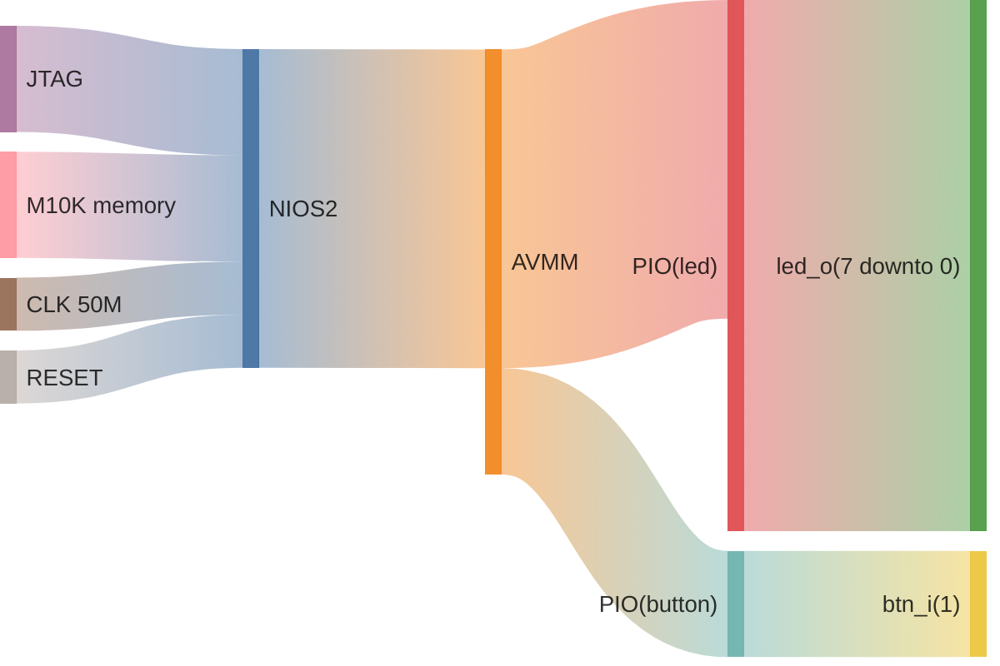

# ESN LAB 1 - Led chaser

to start cygwin from powershell:
```pwsh
& 'C:\intelFPGA\18.1\nios2eds\Nios II Command Shell.bat'
```

to generate bsp:

```bash
nios2-bsp hal ./software/bsp/ ./*.sopcinfo
```

to generate makefile:
```bash
nios2-app-generate-makefile \
--app-dir ./software/app \
--bsp-dir ./software/bsp \
--elf-name maion.elf \
--src-files ./sofware/app/main.c
```

## Introduction

In this lab we have to make an 8 bit led chaser using a NIOS2 core and PIOs.

## System architecture



## Progress
This lab is fully working, with a chaser that is started and stopped by KEY0.

## Conclusion
The new IRQ api is very badly documented.

This is a working implementation:

```c
#include "sys/alt_stdio.h"
#include "system.h"
#include "io.h"
#include "alt_types.h"
#include "sys/alt_irq.h"
#include "altera_avalon_pio_regs.h"
#include "alt_types.h"

static void btn0_isr(void * context) {
    // ... do IRQ things here
    IOWR_ALTERA_AVALON_PIO_EDGE_CAP(BTN0_BASE, 0x1);    //ack irq
    IORD_ALTERA_AVALON_PIO_EDGE_CAP(BTN0_BASE); //intel asks to do this for some reason
}

int main() {
    IOWR_ALTERA_AVALON_PIO_IRQ_MASK(BTN0_BASE, 0xf); //could be 0x01, we only have one
    IOWR_ALTERA_AVALON_PIO_EDGE_CAP(BTN0_BASE, 0x0);

    alt_ic_isr_register(BTN0_IRQ_INTERRUPT_CONTROLLER_ID, BTN0_IRQ, btn0_isr, 0x00, 0x00);
    alt_ic_irq_enable(BTN0_IRQ_INTERRUPT_CONTROLLER_ID, BTN0_IRQ); // this is important

    while (1) {
         //... code here
    }
    return 0;
}
```